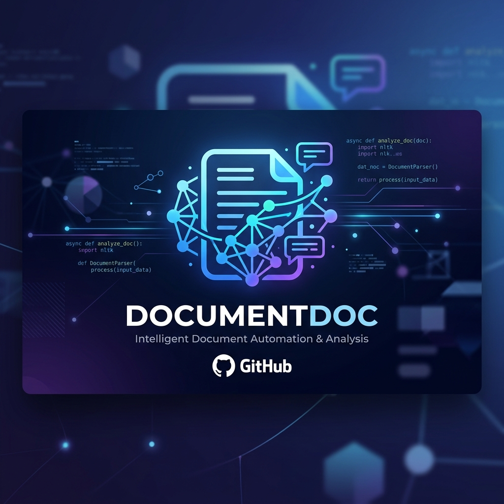
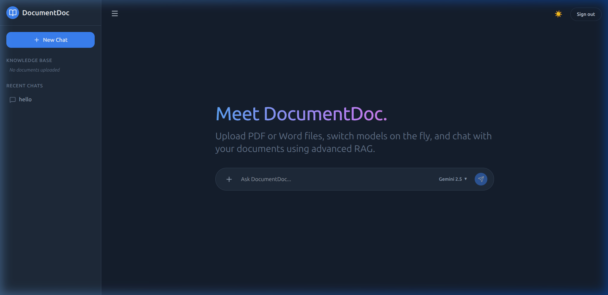

# <p align="center"></p>

<p align="center">
  
  
  
  
  
  
</p>

---

## 🌟 Introduction

**DocumentDoc** is an advanced, production-grade Retrieval-Augmented Generation (RAG) platform. It allows users to upload unstructured documents (PDFs, Word documents, text files), automatically processes them into semantic vectors, and enables a highly interactive, context-aware conversational interface. 

Designed with recruiter-level aesthetics, it replicates a premium modern AI assistant interface (featuring rich transitions, clean light/dark modes, and sleek layouts) coupled with a robust, enterprise-ready Python backend.

---

## 📸 UI Preview

<p align="center">
  
</p>

---

## 🚀 Key Features

*   **⚡ Multi-Format Document Ingestion:** Supports high-fidelity ingestion of PDF, DOCX, and TXT files using specialized parsers like `pymupdf4llm` and `python-docx` to preserve structural layouts and formatting.
*   **🧠 Intelligent Hybrid Retrieval & Reranking:**
    *   *Query Rewriting:* Utilizes an LLM to refine user queries into standalone search questions optimized for vector search.
    *   *Ensemble Retrieval:* Queries ChromaDB vector store with HuggingFace embeddings (`all-MiniLM-L6-v2`) for both the original and rewritten queries, merging results cleanly.
    *   *LLM Reranking:* Reranks candidate document chunks using LiteLLM to ensure only the top $K$ most contextually relevant passages are supplied to the generation model.
*   **💬 Dynamic Model Selector:** Switch on-the-fly between LLM providers (e.g., **Gemini 2.5 Flash** and **Llama 3.3 via Groq**) for both chat responses and RAG processes.
*   **📂 Session-Specific File Filtering:** Attach or detach uploaded knowledge base documents dynamically to scope queries to specific files.
*   **💾 Conversation Persistence:** Integrated SQLite storage for saving chat histories and maintaining persistent sessions across reloads.
*   **🎨 Premium UI/UX:** Styled using custom Vanilla CSS and Tailwind CSS, featuring smooth transitions, adaptive themes, side-drawers, and responsive layouts.
*   **🔒 Mock Authentication Layer:** Easily runs locally with a fully functional Supabase configuration or a custom mock authentication system for instant evaluation.

---

## 🏗️ System Architecture

The following flow diagram illustrates the end-to-end RAG architecture implemented in DocumentDoc:

```mermaid
graph TD
    %% Styling
    classDef frontend fill:#dbeafe,stroke:#2563eb,stroke-width:2px;
    classDef backend fill:#fef08a,stroke:#ca8a04,stroke-width:2px;
    classDef db fill:#bbf7d0,stroke:#16a34a,stroke-width:2px;
    
    %% Ingestion Pipeline
    subgraph Ingestion_Pipeline ["Document Ingestion Pipeline"]
        A[User Uploads PDF / DOCX / TXT]:::frontend --> B[process_file_to_markdown]:::backend
        B --> C[LLM Chunking & Overlap Strategy]:::backend
        C --> D[HuggingFace Embeddings Generator]:::backend
        D --> E[(ChromaDB Vector Store)]:::db
    end

    %% Inference Pipeline
    subgraph Query_RAG_Pipeline ["Query & Inference Pipeline"]
        F[User Question]:::frontend --> G[LLM Query Rewriter]:::backend
        G --> H[Retrieve original & rewritten query matches]:::backend
        H --> I[Merge Chunks & De-duplicate]:::backend
        I --> J[LiteLLM Reranker]:::backend
        J --> K[Construct Context-Augmented Prompt]:::backend
        K --> L[LLM Generation (Gemini / Llama 3)]:::backend
        L --> M[SQLite Save Message]:::db
        L --> N[Stream Answer to UI]:::frontend
    end
```

---

## 🛠️ Tech Stack & Architecture Choices

| Layer | Technology | Rationale |
| :--- | :--- | :--- |
| **Frontend** | React (Vite), TypeScript | Component-based modular structure, lightning-fast HMR, and compile-time type safety. |
| **Styling** | Tailwind CSS | Utility-first responsive design, modern typography, and clean light/dark themes. |
| **Backend** | FastAPI (Python) | High-performance asynchronous API framework with automated OpenAPI validation. |
| **Vector DB** | ChromaDB | Lightweight, high-performance local vector database, perfect for persistent semantic querying. |
| **Embeddings** | HuggingFace (`all-MiniLM-L6-v2`) | Local execution (no API costs) with great semantic representation. |
| **LLM Gateway** | LiteLLM | Standardized OpenAI-format endpoint abstraction supporting Gemini, Groq, and custom APIs. |
| **Auth** | Supabase Auth (Mock/Live) | Drop-in enterprise authentication supporting OAuth and magic link logins. |

---

## 📂 Project Structure

```directory
.
├── backend/
│   ├── answer.py              # Query rewriting, vector query, and reranking pipelines
│   ├── database.py            # SQLite chat history manager
│   ├── Dockerfile             # Multi-stage Docker build for python environment
│   ├── ingest.py              # Text extraction, LLM chunking, and embedding generation
│   ├── main.py                # FastAPI server and controller endpoints
│   └── requirements.txt       # Python application dependencies
├── frontend/
│   ├── Dockerfile             # Alpine-based Node.js runtime config
│   ├── package.json           # React dependencies and scripts
│   ├── tailwind.config.js     # Custom color tokens and dark-mode configuration
│   └── src/
│       ├── App.tsx            # Main layout orchestration and application state
│       ├── components/
│       │   ├── Auth.tsx       # Supabase-compatible authentication UI
│       │   ├── ChatInterface.tsx # Dynamic conversation window
│       │   └── Sidebar.tsx    # Knowledge base manager & chat history layout
│       └── lib/
│           └── supabase.ts    # Live client & local mock authentication fallback
├── docker-compose.yml         # Container orchestration configuration
└── README.md                  # Developer & recruiter documentation
```

---

## ⚙️ Installation & Getting Started

### Prerequisites
*   [Docker](https://www.docker.com/get-started/) and [Docker Compose](https://docs.docker.com/compose/)
*   Alternatively: Python 3.10+ and Node.js 18+ for manual installation.

### Configuration
1. Create a `.env` file in the root directory:
   ```env
   # LLM Keys
   GOOGLE_API_KEY=your_gemini_api_key_here
   GROQ_API_KEY=your_groq_api_key_here
   
   # Supabase Keys (Optional: Falls back to offline mock auth if left empty)
   VITE_SUPABASE_URL=your_supabase_project_url
   VITE_SUPABASE_ANON_KEY=your_supabase_anon_key
   ```

### Running with Docker (Recommended)
Build and run the entire stack with a single command:
```bash
docker compose up --build
```
*   **Frontend Client:** `http://localhost:5173`
*   **Backend REST API Docs:** `http://localhost:8000/docs`

---

## 🌟 Future Roadmap

- [ ] Add streaming chunk responses using Server-Sent Events (SSE).
- [ ] Implement advanced metadata filtering (by date, size, author) during vector queries.
- [ ] Add support for image/diagram parsing from PDF inputs (Multimodal Ingestion).
- [ ] Support local LLMs via Ollama integration.

---

## 📄 License
This project is licensed under the MIT License - see the LICENSE file for details.
